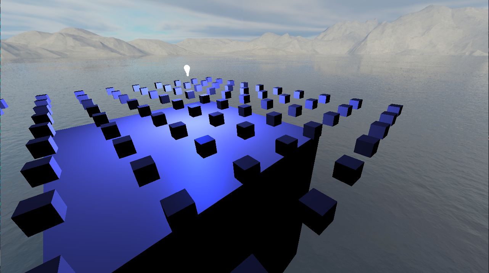

# OpenGL Renderer

This is a simple renderer made using OpenGL. It uses the SDL2 library for opening
a window and for handling input, ASSIMP for loading model files, GLAD for loading
OpenGL functions, GLM for math, and STB_image for loading textures.

It is a work in progress, and currently supports a few basic features such as
Phoung shading, a movable camera, a skybox, etc.



## Building:

This project uses a simple makefile. All you need to do is clone this repo, and
in the main folder with the makefile, run:

```bash
make
```

and that should compile the executable. To run it, use:

```bash
./OpenGLrenderer
```

## Controls:

The camera can be moved using the WASD keys, and you can look with the mouse. You
can also zoom the camera in and out using the mouse wheel. To move the camera
faster, hold Left Shift. To free the mouse, press Escape. To quit the program,
press q.
